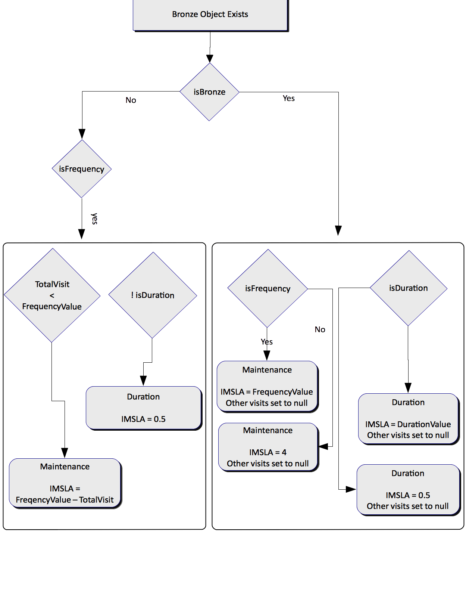

<!--autoheader--><p align='center'>[ &larr; <a href='/resources/documentation/02.%20introduction.md#introduction'>Introduction</a> ]&nbsp;&nbsp;&nbsp;&nbsp;&nbsp;[ <a href='/README.md'>Table Of Contents</a> &uarr; ]&nbsp;&nbsp;&nbsp;&nbsp;&nbsp;[ <a href='/resources/documentation/04.%20resources.md#resources'>Resources</a> &rarr; ]</p><!--/autoheader-->

# Service Endpoints

There is a single ReSTful service endpoint that is used with different payloads to retrieve different responses.  These endpoints are documented in detail below.

## Signature of Resource
The signature of the resource (endpoint) is as follows:

```
http://<domain>/kie-server/services/rest/server/containers/instances/planning
```
The domain depends on the environment, as detailed below.

## Environments

There are several OpenShift containers stood up for the different environments.  The Development (DEV) environment will contain code that has not passed system testing and contains code for the current sprint.  The System (QA) environment contains code that has successfully passed system testing and is ready to be consumed by external resources.  Use these environments accordingly.

|Environment | URL|
|----------- | ----|
|Development (DEV) | https://tke-rules-servicesight-rules-dev.3a7a.tke.openshiftapps.com|
|System (QA, Testing) | https://tke-rules-servicesight-rules-test.3a7a.tke.openshiftapps.com|
|Pre-Production (PreProd) | https://tke-rules-servicesight-rules-preprod.3a7a.tke.openshiftapps.com|
|Production (Prod) | https://tke-rules-servicesight-rules-prod.3a7a.tke.openshiftapps.com|

## Request Headers and Method

Every request to the endpoint must include all of the following HTTP Request Headers.

|Header | Value|
|-------| -----|
|Content-Type | application/json|
|Accept | application/json|
|X-KIE-ContentType |JSON|
|Authorization | Basic < base64 Encoded Username and Password >|

Every request to the endpoint must use the `'POST'` request method.

A sample curl request looks as follows:
```
curl -H "Content-Type: application/json" -H "Accept: application/json" -H "X-KIE-ContentType: JSON" -u '<username>:<password>' -X POST --data @body.json http://service-sight-rules-playground.3a7a.tke.openshiftapps.com/kie-server/services/rest/server/containers/instances/planning
```
## Types of Requests
Although there is only one endpoint, there are several responses that could be obtained by the server depending on the request.  The input payload essentially determines the response and the process type.  The process types could be:
* **ScoringProcess** - Given a product object, calculate the score associated with that product
* **MaintenanceProcess** - Given a score object, calculate the maintenance for PM, PM/D, IM, PT, PM/MMR, and CAT1
* **DurationProcess** - Given the score and the product object, calculate the duration for PM, PM/D, IM, PT, PM/MMR, and CAT1
* **CompleteProcess** - Given the product and number of openings, calculate everything for maintenance, duration, and bronze

### Anatomy of the Payload
The request payload is a JSON object that consists of several different parts.  These parts combined provide the information required to run the rules.  The payload consists of a lookup value and a list of commands.  

#### lookup
The lookup section within the JSON payload defines the knowledge session identifier on which the commands are to be executed.  Currently, there is only one lookup supported by the TKE rules, namely ``defaultStatelessKieSession``.

```js
{
    "lookup":"defaultStatelessKieSession"
    ,"...":"..."
}
```
#### commands
The commands section within the JSON payload is a list of commands that are executed against the knowledge session.  The commands of interest for our purpose are `insert`, `start-process`, `fire-all-rules`, and `query`.

>NOTE:<br>There are several different commands that could be used within this list that will not be covered by this section.  For more information, please see <a href="https://access.redhat.com/documentation/en-US/Red_Hat_JBoss_BPM_Suite/6.3/html/Development_Guide/chap_the_exec_server.html#brms_commands">BRMS Documentations</a>.

##### insert
The first set of commands of interest in the list is the `insert` command. This command will be used to insert models (objects) with corresponding elements populated with values that will be used to calculate the response. Only classes that are predefined can be inserted by this command.  The predefined classes are as follows:
* **com.tke.servicesight.rules.model.Product** - Product object that contains elements describing the product
* **com.tke.servicesight.rules.model.Score** - The Score object that contains the score and service level
* **com.tke.servicesight.rules.model.Bronze** - The Bronze object that contains information about the bronze object to offset the Maintenance and Duration IM-SLA

>NOTE:<br>Each object that is inserted has an 'id' element.  This element must be populated with a unique identifier when more than one of the same type of object is inserted, in the case of batching a set of products for responses.  This will ensure that the response object will have the same unique identifier passed through from the inserted object so that the caller can correlate the response with the correct inserted object.<br><br>The section detailing the Process Types will provide more information on which objects to insert.

```js
{
	"...":"...",
    "commands":[{
         "insert":{
            "object":{
               "com.tke.servicesight.rules.model.Product":{
                  "unitType":"EL-HY-003",
                  "environment":"clean",
                  "controlType":"microprocessor",
                  "annualCallbacks":"1",
                  "usage":"high",
                  "id":"ABC123",
                  "driveType":"MG/Generator",
                  "location":"indoor",
                  "foreignEquipment":true,
                  "bipartingPowerDoor":false,
                  "freightDoor":false,
                  "numRearCarDoors":5,
                  "numFrontCarDoors":5
               }
            }
         },
         "...":"..."
      }]
 }
 ```   

##### start-process
The second command, `start-process` command essentially dictates which Process Type to run, namely `scoring`, `maintenance`, or `duration`.  

The following processes are supported:
* **com.tke.servicesight.rules.ScoringProcess** - Process type to score a given a Product
* **com.tke.servicesight.rules.MaintenanceProcess** - Process type to calculate the maintenance given a Product and Score
* **com.tke.servicesight.rules.DurationProcess** - Process type to calculate the duration given a Product and Score
* **com.tke.servicesight.rules.CompleteProcess** - Process that calculate everything including scores, maintenance, duration, and bronze given the product and number of openings

```js
{
   "...":"...",
   "commands":[
      {"..." :"..."},
      {
         "start-process":{
            "processId":"com.tke.servicesight.rules.DurationProcess"
         }
      },
      {"...":"..."}
   ]
}
```

##### fire-all-rules
The third command, `fire-all-rules` finalizes all of the inserted objects and runs these objects through the appropriate rules.

```js
{
   "...":"...",
   "commands":[
      {"..." :"..."},
      {
         "fire-all-rules":""
      },
      {"...":"..."}
   ]
}
```

##### query
The final command `query` is used to retrieve the responses from BRMS based on an identifier named 'out-identifier' and the name of the query. The 'out-identifier' will be different depending on the process type.

There are several queries that can be used to retrieve different results as detailed below.  Each :

| Type | Query |Returned List Objects
|------|-------|--------------------|
|Bronze|getBronze|List of com.tke.servicesight.rules.model.Bronze|
|Duration|getDurations|List of com.tke.servicesight.rules.model.Duration<br>List of com.tke.servicesight.rules.model.ValidationError|
|Maintenance|getMaintenances|List of com.tke.servicesight.rules.model.Maintenance<br>List of com.tke.servicesight.rules.model.ValidationError|
|Score|getScores|List of com.tke.servicesight.rules.model.Score<br>List of com.tke.servicesight.rules.model.ValidationError|
|Product|getProducts|List of com.tke.servicesight.rules.model.Product|


```js
{
   "...":"...",
   "commands":[
      {"..." :"..."},
      {
         "query":{
             "name": "getDurations",
             "out-identifier" : "durations"
         }
      },
   ]
}
```

### Process Type
Although there is only one endpoint to which the client connects, the Process Type dictates the type of rules that are executed.  The responses will also be dependent on the Process Type that is invoked.  The following process types are implemented.

* **Score** - com.tke.servicesight.rules.ScoringProcess
* **Maintenance** - com.tke.servicesight.rules.MaintenanceProcess
* **Duration** - com.tke.servicesight.rules.DurationProcess

#### Score :: Process Type
The `score` Process Type uses a Product object to calculate the score associated with it.  The score is calculated given several different characteristics, such as annual callbacks, control types, environment, usage, unit type, and drive type.  These characteristics are specified in the Product object.

##### Request
The request **JSON** payload will contain a Product object that contains all of the information required to execute the rules.

**Content-Type: application/json**

>NOTE:<br>The [Signature](#signature-of-resource), [Environments](#environments), and [Headers](#request-headers-and-method) are detailed above.

Depending on the Product Type, the following characteristics must be provided.

<table>
	<thead>
		<tr>
			<th>&nbsp;</th>
			<th colspan='6'>com.tke.servicesight.rules.model.Product</th>
		</tr>
		<tr>
			<th>Product Type</th>
			<th>unitType</th>
			<th>annualCallbacks</th>
			<th>controlType</th>
			<th>usage</th>
			<th>environment</th>
			<th>driveType</th>
			<th>location</th>
			<th>foreignEquipment</th>
			<th>bipartingPowerDoor</th>
			<th>freightDoor</th>
			<th>rearCarDoor</th>
		</tr>
	</thead>
	<tbody>
		<tr>
			<td><b>Dumbwaiter</b></td>
			<td>&check;</td><td>&check;</td><td>&check;</td><td>&check;</td><td>&check;</td>
			<td>&nbsp;</td>
			<td>&nbsp;</td><td>&nbsp;</td><td>&nbsp;</td><td>&nbsp;</td><td>&nbsp;</td>
		</tr>
		<tr>
			<td><b>Escalator-Moving Walk</b></td>
			<td></td><td></td><td></td><td>&check;</td><td></td>
			<td>&nbsp;</td>
			<td>&check;</td><td>&nbsp;</td><td>&nbsp;</td><td>&nbsp;</td><td>&nbsp;</td>			
		</tr>
		<tr>
			<td><b>Hydraulic</b></td>
			<td>&check;</td><td>&check;</td><td>&check;</td><td>&check;</td><td>&check;</td>
			<td>&nbsp;</td>
			<td>&nbsp;</td><td>&check;</td><td>&check;</td><td>&nbsp;</td><td>&nbsp;</td>
		</tr>
		<tr>
			<td><b>Lift</b></td>
			<td>&check;</td><td>&check;</td><td>&check;</td><td>&check;</td><td>&check;</td>
			<td>&nbsp;</td>
			<td>&nbsp;</td><td>&check;</td><td>&check;</td><td>&nbsp;</td><td>&nbsp;</td>		
		</tr>
		<tr>
			<td><b>MRL-Traction</b></td>
			<td>&check;</td><td>&check;</td><td>&check;</td><td>&check;</td><td>&check;</td>
			<td>&nbsp;</td>
			<td>&nbsp;</td><td>&check;</td><td>&nbsp;</td><td>&check;</td><td>&check;</td>
		</tr>
		<tr>
			<td><b>Traction</b></td>
			<td>&check;</td><td>&check;</td><td>&check;</td><td>&check;</td><td>&check;</td>
			<td>&check;</td>
			<td>&nbsp;</td><td>&check;</td><td>&nbsp;</td><td>&check;</td><td>&nbsp;</td>
		</tr>
	</tbody>
</table>

For instance, a unit type that falls into the product type of `traction` will contain the following characteristics.

```java
unitType = "EL-TR-001";
environment = "dirty";
controlType = "microprocessor";
annualCallbacks = "7";
driveType = "MG\/Generator";
usage = "low";
id = "ABC123";
```

The request payload is as follows:

```js
{
   "lookup":"defaultStatelessKieSession",
   "commands":[
      {
         "insert":{
            "object":{
               "com.tke.servicesight.rules.model.Product":{
                  "unitType":"EL-TR-003",
                  "environment":"dirty",
                  "controlType":"microprocessor",
                  "annualCallbacks":"7",
                  "driveType":"MG\/Generator",
                  "usage":"low",
                  "id":"ABC123"
               }
            }
         }
      },
      {
         "start-process":{
            "processId":"com.tke.servicesight.rules.ScoringProcess"
         }
      },
      {
         "fire-all-rules":""
      },
      {
         "query":{
            "name":"getScores",
            "out-identifier":"response"
         }
      }
   ]
}

```

##### Response
The **JSON** response consists of several elements that provides additional information regarding the rule execution process.  The only elements of concern are `type`, `msg`, and `results`.

> **Content-Type: application/json**

The `type` element indicates the status of the request, either **SUCCESS** or **FAILURE** and in both cases, the Response Header Code will be `200`.  

In case of **FAILURE**, check the `msg` element within the JSON response that will indicate the reason for the failure.

>A **FAILURE** response:

```js
{
  "type" : "FAILURE",
  "msg" : "Error calling container 69fcdc0c6203e31b9d2688970e4b51ef: Unknown process ID: com.tke.servicesight.rules.ScoringProcessblah",
  "result" : null
}
```

When the `type` is **SUCCESS**, check JSON-path of the the `results` element as follows.

```js
score = $.'result'.'execution-results'.'results'.[?(@.key == 'response')].value.['org.drools.core.runtime.rule.impl.FlatQueryResults'].'idResultMaps'.'element'.[0].'element'.[?(@.key == 'scores')].'value'.[0].['com.tke.servicesight.rules.model.Score'].'score'
serviceLevel = $.'result'.'execution-results'.'results'.[?(@.key == 'response')].value.['org.drools.core.runtime.rule.impl.FlatQueryResults'].'idResultMaps'.'element'.[0].'element'.[?(@.key == 'scores')].'value'.[0].['com.tke.servicesight.rules.model.Score'].'serviceLevel'
id = $.'result'.'execution-results'.'results'.[?(@.key == 'response')].value.['org.drools.core.runtime.rule.impl.FlatQueryResults'].'idResultMaps'.'element'.[0].'element'.[?(@.key == 'scores')].'value'.[0].['com.tke.servicesight.rules.model.Score'].'id'
```

>A **SUCCESS** response:

```js
{
   "type":"SUCCESS",
   "msg":"Container 69fcdc0c6203e31b9d2688970e4b51ef successfully called.",
   "result":{
      "execution-results":{
         "results":[
            {
               "key":"",
               "value":7
            },
            {
               "key":"response",
               "value":{
                  "org.drools.core.runtime.rule.impl.FlatQueryResults":{
                     "idFactHandleMaps":{
                        "type":"LIST",
                        "componentType":null,
                        "element":[
                           {
                              "type":"MAP",
                              "componentType":null,
                              "element":[
                                 {
                                    "key":"scores",
                                    "value":{
                                       "org.drools.core.common.DisconnectedFactHandle":{
                                          "id":4,
                                          "identityHashCode":657619275,
                                          "objectHashCode":924019,
                                          "recency":10,
                                          "object":[
                                             {
                                                "com.tke.servicesight.rules.model.Score":{
                                                   "score":15,
                                                   "serviceLevel":2,
                                                   "openings":null,
                                                   "id":"ABC123"
                                                }
                                             }
                                          ],
                                          "traitType":"NON_TRAIT",
                                          "negated":false,
                                          "external-form":"0:4:657619275:924019:10:null:NON_TRAIT:java.util.ArrayList"
                                       }
                                    }
                                 }
                              ]
                           }
                        ]
                     },
                     "idResultMaps":{
                        "type":"LIST",
                        "componentType":null,
                        "element":[
                           {
                              "type":"MAP",
                              "componentType":null,
                              "element":[
                                 {
                                    "key":"scores",
                                    "value":[
                                       {
                                          "com.tke.servicesight.rules.model.Score":{
                                             "score":15,
                                             "serviceLevel":2,
                                             "openings":null,
                                             "id":"ABC123"
                                          }
                                       }
                                    ]
                                 }
                              ]
                           }
                        ]
                     },
                     "identifiers":{
                        "type":"SET",
                        "componentType":null,
                        "element":[
                           "scores"
                        ]
                     }
                  }
               }
            }
         ],
         "facts":[

         ]
      }
   }
}
```

#### Maintenance (Frequency) :: Process Type
The `Maintenance` Process Type uses the Product object and the Score object to calculate the maintenance associated with the product.  The maintenance is calculated given several different characteristics for each objects as described below.

##### Request

The request **JSON** payload will contain a Product object and a Score object that contains all of the information required to execute the rules.

>NOTE:<br>The [Signature](#signature-of-resource), [Environments](#environments), and [Headers](#request-headers-and-method) are detailed above.

The following characteristics for each object (Product and Score) must be provided for the different Product Types.

<table>
	<thead>
		<tr>
			<th>&nbsp;</th>
			<th>com.tke.servicesight.rules.model.Product</th>
			<th colspan='2'>com.tke.servicesight.rules.model.Score</th>
		</tr>
	</thead>
		<tr>
			<th><b>Product Type</b></th>
			<th>unitType</th>
			<th>serviceLevel</th>
			<th>openings</th>
		</tr>
	<tbody>
		<tr>
			<td><b>Dumbwaiter</b></td><td>&check;</td><td>&check;</td><td></td>
		</tr>
		<tr>
			<td><b>Escalator-Moving Walk</b></td><td>&check;</td><td>&check;</td><td></td>
		</tr>
		<tr>
			<td><b>Hydraulic</b></td><td>&check;</td><td>&check;</td><td>&check;</td>
		</tr>
		<tr>
			<td><b>Lift</b></td><td>&check;</td><td>&check;</td><td></td>
		</tr>
		<tr>
			<td><b>MRL-Traction</b></td><td>&check;</td><td>&check;</td><td>&check;</td>
		</tr>
		<tr>
			<td><b>Traction</b></td><td>&check;</td><td>&check;</td><td>&check;</td>
		</tr>
	</tbody>
</table>

For instance, a unit type that falls into the product type of `hydraulic` will contain the following characteristics.

```java
com.tke.servicesight.rules.model.Product.unitType = "EL-HY-001";
com.tke.servicesight.rules.model.Score.serviceLevel = 3;
com.tke.servicesight.rules.model.Score.openings = 14;
```

The request payload is as follows:

```js
{
   "lookup":"defaultStatelessKieSession",
   "commands":[
      {
         "insert":{
            "object":{
               "com.tke.servicesight.rules.model.Score":{
                  "serviceLevel":"3",
                  "openings":"14",
                  "id":"ABC123"
               }
            }
         }
      },
      {
         "insert":{
            "object":{
               "com.tke.servicesight.rules.model.Product":{
                  "unitType":"EL-HY-001",
                  "id":"ABC123"
               }
            }
         }
      },
      {
         "start-process":{
            "processId":"com.tke.servicesight.rules.MaintenanceProcess"
         }
      },
      {
         "fire-all-rules":""
      },
      {
         "query":{
            "name":"getMaintenances",
            "out-identifier":"response"
         }
      }
   ]
}
```

##### Response
As with the Score Process Type, the response JSON consists of several elements, but the only elements of concern are `type`, `msg`, and `results`.

> **Content-Type: application/json**

The `type` element indicates the status of the request, either **SUCCESS** or **FAILURE** and in both cases, the Response Header Code will be `200`.  

In case of **FAILURE**, check the `msg` element within the JSON response that will indicate the reason for the failure.

>A **FAILURE** response:

```js
{
   "type":"FAILURE",
   "msg":"Error calling container 69fcdc0c6203e31b9d2688970e4b51ef: Error unmarshalling input",
   "result":null
}
```

When the `type` is **SUCCESS**, check JSON-path of the the `results` element as follows.
```js
pm = $.'result'.'execution-results'.'results'.[?(@.key == 'response')].value.['org.drools.core.runtime.rule.impl.FlatQueryResults'].'idResultMaps'.'element'.[0].'element'.[?(@.key == 'maintenances')].'value'.[0].['com.tke.servicesight.rules.model.Maintenance'].'pm';
pmd = $.'result'.'execution-results'.'results'.[?(@.key == 'response')].value.['org.drools.core.runtime.rule.impl.FlatQueryResults'].'idResultMaps'.'element'.[0].'element'.[?(@.key == 'maintenances')].'value'.[0].['com.tke.servicesight.rules.model.Maintenance'].'pmd';
im = $.'result'.'execution-results'.'results'.[?(@.key == 'response')].value.['org.drools.core.runtime.rule.impl.FlatQueryResults'].'idResultMaps'.'element'.[0].'element'.[?(@.key == 'maintenances')].'value'.[0].['com.tke.servicesight.rules.model.Maintenance'].'im';
pt = $.'result'.'execution-results'.'results'.[?(@.key == 'response')].value.['org.drools.core.runtime.rule.impl.FlatQueryResults'].'idResultMaps'.'element'.[0].'element'.[?(@.key == 'maintenances')].'value'.[0].['com.tke.servicesight.rules.model.Maintenance'].'pt';
pmMmr = $.'result'.'execution-results'.'results'.[?(@.key == 'response')].value.['org.drools.core.runtime.rule.impl.FlatQueryResults'].'idResultMaps'.'element'.[0].'element'.[?(@.key == 'maintenances')].'value'.[0].['com.tke.servicesight.rules.model.Maintenance'].'pmMmr';
cat1 = $.'result'.'execution-results'.'results'.[?(@.key == 'response')].value.['org.drools.core.runtime.rule.impl.FlatQueryResults'].'idResultMaps'.'element'.[0].'element'.[?(@.key == 'maintenances')].'value'.[0].['com.tke.servicesight.rules.model.Maintenance'].'cat1';
cleanDown = $.'result'.'execution-results'.'results'.[?(@.key == 'response')].value.['org.drools.core.runtime.rule.impl.FlatQueryResults'].'idResultMaps'.'element'.[0].'element'.[?(@.key == 'maintenances')].'value'.[0].['com.tke.servicesight.rules.model.Maintenance'].'cleanDown';
st = $.'result'.'execution-results'.'results'.[?(@.key == 'response')].value.['org.drools.core.runtime.rule.impl.FlatQueryResults'].'idResultMaps'.'element'.[0].'element'.[?(@.key == 'maintenances')].'value'.[0].['com.tke.servicesight.rules.model.Maintenance'].'st';
id = $.'result'.'execution-results'.'results'.[?(@.key == 'response')].value.['org.drools.core.runtime.rule.impl.FlatQueryResults'].'idResultMaps'.'element'.[0].'element'.[?(@.key == 'maintenances')].'value'.[0].['com.tke.servicesight.rules.model.Maintenance'].'id';
```


>A **SUCCESSS** response:

```js
{
   "type":"SUCCESS",
   "msg":"Container 69fcdc0c6203e31b9d2688970e4b51ef successfully called.",
   "result":{
      "execution-results":{
         "results":[
            {
               "key":"",
               "value":3
            },
            {
               "key":"response",
               "value":{
                  "org.drools.core.runtime.rule.impl.FlatQueryResults":{
                     "idFactHandleMaps":{
                        "type":"LIST",
                        "componentType":null,
                        "element":[
                           {
                              "type":"MAP",
                              "componentType":null,
                              "element":[
                                 {
                                    "key":"maintenances",
                                    "value":{
                                       "org.drools.core.common.DisconnectedFactHandle":{
                                          "id":5,
                                          "identityHashCode":733759195,
                                          "objectHashCode":1742840251,
                                          "recency":6,
                                          "object":[
                                             {
                                                "com.tke.servicesight.rules.model.Maintenance":{
                                                   "pm":1,
                                                   "pmd":3,
                                                   "im":0,
                                                   "pt":1,
                                                   "pmMmr":null,
                                                   "cat1":null,
                                                   "cleanDown":null,
                                                   "st":null,
                                                   "id":"ABC123"
                                                }
                                             }
                                          ],
                                          "traitType":"NON_TRAIT",
                                          "negated":false,
                                          "external-form":"0:5:733759195:1742840251:6:null:NON_TRAIT:java.util.ArrayList"
                                       }
                                    }
                                 }
                              ]
                           }
                        ]
                     },
                     "idResultMaps":{
                        "type":"LIST",
                        "componentType":null,
                        "element":[
                           {
                              "type":"MAP",
                              "componentType":null,
                              "element":[
                                 {
                                    "key":"maintenances",
                                    "value":[
                                       {
                                          "com.tke.servicesight.rules.model.Maintenance":{
                                             "pm":1,
                                             "pmd":3,
                                             "im":0,
                                             "pt":1,
                                             "pmMmr":null,
                                             "cat1":null,
                                             "cleanDown":null,
                                             "st":null,
                                             "id":"ABC123"
                                          }
                                       }
                                    ]
                                 }
                              ]
                           }
                        ]
                     },
                     "identifiers":{
                        "type":"SET",
                        "componentType":null,
                        "element":[
                           "maintenances"
                        ]
                     }
                  }
               }
            }
         ],
         "facts":[

         ]
      }
   }
}
```

#### Duration :: Process Type
The `Duration` Process Type uses the Product object and the Score object to calculate the duration associated with the product.  The duration is calculated given several different characteristics for each objects as described below.

##### Request

The request **JSON** payload will contain a Product object and a Score object that contains all of the information required to execute the rules.

>NOTE:<br>The [Signature](#signature-of-resource), [Environments](#environments), and [Headers](#request-headers-and-method) are detailed above.

The following characteristics for each object (Product and Score) must be provided for the different Product Types.

<table>
	<thead>
		<tr>
			<th>&nbsp;</th>
			<th colspan='8'>com.tke.servicesight.rules.model.Product</th>
			<th>com.tke.servicesight.rules.model.Score</th>
		</tr>
	</thead>
		<tr>
			<th><b>Product Type</b></th>
			<th>unitType</th>
			<th>foreignEquipment</th>
			<th>bipartingPowerDoor</th>
			<th>freightDoor</th>
			<th>usage</th>
			<th>location</th>
			<th>numRearCarDoors</th>
			<th>numFrontCarDoors</th>			
			<th>serviceLevel</th>
		</tr>
	<tbody>
		<tr>
			<td><b>Dumbwaiter</b></td><td>&check;</td><td></td><td></td><td></td><td></td><td></td><td></td><td></td><td>&check;</td>
		</tr>
		<tr>
			<td><b>Escalator-Moving Walk</b></td><td>&check;</td><td></td><td></td><td></td><td>&check;</td><td>&check;</td><td></td><td></td><td>&check;</td>
		</tr>
		<tr>
			<td><b>Hydraulic</b></td><td>&check;</td><td>&check;</td><td>&check;</td><td></td><td></td><td></td><td>&check;</td><td>&check;</td><td>&check;</td>
		</tr>
		<tr>
			<td><b>Lift</b></td><td>&check;</td><td></td><td></td><td></td><td></td><td></td><td></td><td></td><td>&check;</td>
		</tr>
		<tr>
			<td><b>MRL-Traction</b></td><td>&check;</td><td>&check;</td><td></td><td>&check;</td><td></td><td></td><td>&check;</td><td>&check;</td><td>&check;</td>
		</tr>
		<tr>
			<td><b>Traction</b></td><td>&check;</td><td>&check;</td><td></td><td>&check;</td><td></td><td></td><td>&check;</td><td>&check;</td><td>&check;</td>
		</tr>
	</tbody>
</table>

For instance, a unit type that falls into the product type of `hydraulic` will contain the following characteristics.

```java
com.tke.servicesight.rules.model.Product.unitType = "EL-HY-001";
com.tke.servicesight.rules.model.Score.serviceLevel = 3;
com.tke.servicesight.rules.model.Score.foreignEquipment = true;
com.tke.servicesight.rules.model.Score.bipartingPowerDoor = false;
com.tke.servicesight.rules.model.Score.numRearCarDoors = 5;
com.tke.servicesight.rules.model.Score.numFrontCarDoors = 5;
```

The request payload is as follows:

```js
{
   "lookup":"defaultStatelessKieSession",
   "commands":[
      {
         "insert":{
            "object":{
               "com.tke.servicesight.rules.model.Score":{
                  "serviceLevel":"3",
                  "foreignEquipment":true,
                  "bipartingPowerDoor":false,
                  "id":"ABC123"
               }
            }
         }
      },
      {
         "insert":{
            "object":{
               "com.tke.servicesight.rules.model.Product":{
                  "unitType":"EL-HY-001",
                  "id":"ABC123"
               }
            }
         }
      },
      {
         "start-process":{
            "processId":"com.tke.servicesight.rules.MaintenanceProcess"
         }
      },
      {
         "fire-all-rules":""
      },
      {
         "query":{
            "name":"getDurations",
            "out-identifier":"response"
         }
      }
   ]
}
```

##### Response
As with the Score Process Type, the response JSON consists of several elements, but the only elements of concern are `type`, `msg`, and `results`.

> **Content-Type: application/json**

The `type` element indicates the status of the request, either **SUCCESS** or **FAILURE** and in both cases, the Response Header Code will be `200`.

In case of **FAILURE**, check the `msg` element within the JSON response that will indicate the reason for the failure.

>A **FAILURE** response:

```js
{
   "type":"FAILURE",
   "msg":"Error calling container 69fcdc0c6203e31b9d2688970e4b51ef: Error unmarshalling input",
   "result":null
}
```

When the `type` is **SUCCESS**, check JSON-path of the the `results` element as follows.
```js
pm = $.'result'.'execution-results'.'results'.[?(@.key == 'response')].value.['org.drools.core.runtime.rule.impl.FlatQueryResults'].'idResultMaps'.'element'.[0].'element'.[?(@.key == 'durations')].'value'.[0].['com.tke.servicesight.rules.model.Maintenance'].'pm';
pmd = $.'result'.'execution-results'.'results'.[?(@.key == 'response')].value.['org.drools.core.runtime.rule.impl.FlatQueryResults'].'idResultMaps'.'element'.[0].'element'.[?(@.key == 'durations')].'value'.[0].['com.tke.servicesight.rules.model.Maintenance'].'pmd';
im = $.'result'.'execution-results'.'results'.[?(@.key == 'response')].value.['org.drools.core.runtime.rule.impl.FlatQueryResults'].'idResultMaps'.'element'.[0].'element'.[?(@.key == 'durations')].'value'.[0].['com.tke.servicesight.rules.model.Maintenance'].'im';
pt = $.'result'.'execution-results'.'results'.[?(@.key == 'response')].value.['org.drools.core.runtime.rule.impl.FlatQueryResults'].'idResultMaps'.'element'.[0].'element'.[?(@.key == 'durations')].'value'.[0].['com.tke.servicesight.rules.model.Maintenance'].'pt';
pmMmr = $.'result'.'execution-results'.'results'.[?(@.key == 'response')].value.['org.drools.core.runtime.rule.impl.FlatQueryResults'].'idResultMaps'.'element'.[0].'element'.[?(@.key == 'durations')].'value'.[0].['com.tke.servicesight.rules.model.Maintenance'].'pmMmr';
cat1 = $.'result'.'execution-results'.'results'.[?(@.key == 'response')].value.['org.drools.core.runtime.rule.impl.FlatQueryResults'].'idResultMaps'.'element'.[0].'element'.[?(@.key == 'durations')].'value'.[0].['com.tke.servicesight.rules.model.Maintenance'].'cat1';
cleanDown = $.'result'.'execution-results'.'results'.[?(@.key == 'response')].value.['org.drools.core.runtime.rule.impl.FlatQueryResults'].'idResultMaps'.'element'.[0].'element'.[?(@.key == 'durations')].'value'.[0].['com.tke.servicesight.rules.model.Maintenance'].'cleanDown';
st = $.'result'.'execution-results'.'results'.[?(@.key == 'response')].value.['org.drools.core.runtime.rule.impl.FlatQueryResults'].'idResultMaps'.'element'.[0].'element'.[?(@.key == 'durations')].'value'.[0].['com.tke.servicesight.rules.model.Maintenance'].'st';
id = $.'result'.'execution-results'.'results'.[?(@.key == 'response')].value.['org.drools.core.runtime.rule.impl.FlatQueryResults'].'idResultMaps'.'element'.[0].'element'.[?(@.key == 'durations')].'value'.[0].['com.tke.servicesight.rules.model.Maintenance'].'id';
```


>A **SUCCESSS** response:

```js
{
   "type":"SUCCESS",
   "msg":"Container 69fcdc0c6203e31b9d2688970e4b51ef successfully called.",
   "result":{
      "execution-results":{
         "results":[
            {
               "key":"",
               "value":3
            },
            {
               "key":"response",
               "value":{
                  "org.drools.core.runtime.rule.impl.FlatQueryResults":{
                     "idFactHandleMaps":{
                        "type":"LIST",
                        "componentType":null,
                        "element":[
                           {
                              "type":"MAP",
                              "componentType":null,
                              "element":[
                                 {
                                    "key":"durations",
                                    "value":{
                                       "org.drools.core.common.DisconnectedFactHandle":{
                                          "id":5,
                                          "identityHashCode":733759195,
                                          "objectHashCode":1742840251,
                                          "recency":6,
                                          "object":[
                                             {
                                                "com.tke.servicesight.rules.model.Maintenance":{
                                                   "pm":1,
                                                   "pmd":3,
                                                   "im":0,
                                                   "pt":1,
                                                   "pmMmr":null,
                                                   "cat1":null,
                                                   "cleanDown":null,
                                                   "st":null,
                                                   "id":"ABC123"
                                                }
                                             }
                                          ],
                                          "traitType":"NON_TRAIT",
                                          "negated":false,
                                          "external-form":"0:5:733759195:1742840251:6:null:NON_TRAIT:java.util.ArrayList"
                                       }
                                    }
                                 }
                              ]
                           }
                        ]
                     },
                     "idResultMaps":{
                        "type":"LIST",
                        "componentType":null,
                        "element":[
                           {
                              "type":"MAP",
                              "componentType":null,
                              "element":[
                                 {
                                    "key":"durations",
                                    "value":[
                                       {
                                          "com.tke.servicesight.rules.model.Maintenance":{
                                             "pm":1,
                                             "pmd":3,
                                             "im":0,
                                             "pt":1,
                                             "pmMmr":null,
                                             "cat1":null,
                                             "cleanDown":null,
                                             "st":null,
                                             "id":"ABC123"
                                          }
                                       }
                                    ]
                                 }
                              ]
                           }
                        ]
                     },
                     "identifiers":{
                        "type":"SET",
                        "componentType":null,
                        "element":[
                           "durations"
                        ]
                     }
                  }
               }
            }
         ],
         "facts":[

         ]
      }
   }
}
```
#### Complete :: Process Type

The `Complete` Process Type uses the Product object and the `openings` element of the Score object to calculate the everything including score, service level, maintenance, and duration.

##### Request
The request **JSON** payload will contain a Product object and a Score object that contains all of the information required to execute the rules.

>NOTE:<br>The [Signature](#signature-of-resource), [Environments](#environments), and [Headers](#request-headers-and-method) are detailed above.

The following characteristics for each object (Product and Score) must be provided for the different Product Types.

<table>
	<thead>
		<tr>
			<th>&nbsp;</th>
			<th colspan='6'>com.tke.servicesight.rules.model.Product</th>
			<th>com.tke.servicesight.rules.model.Score</th>
		</tr>
	</thead>
		<tr>
			<th><b>Product Type</b></th>
			<th>unitType</th>
			<th>foreignEquipment</th>
			<th>bipartingPowerDoor</th>
			<th>freightDoor</th>
			<th>usage</th>
			<th>location</th>
			<th>openings</th>
		</tr>
	<tbody>
		<tr>
			<td><b>Dumbwaiter</b></td><td>&check;</td><td></td><td></td><td></td><td></td><td></td><td>&check;</td>
		</tr>
		<tr>
			<td><b>Escalator-Moving Walk</b></td><td>&check;</td><td></td><td></td><td></td><td>&check;</td><td>&check;</td><td>&check;</td>
		</tr>
		<tr>
			<td><b>Hydraulic</b></td><td>&check;</td><td>&check;</td><td>&check;</td><td></td><td></td><td></td><td>&check;</td>
		</tr>
		<tr>
			<td><b>Lift</b></td><td>&check;</td><td></td><td></td><td></td><td></td><td></td><td>&check;</td>
		</tr>
		<tr>
			<td><b>MRL-Traction</b></td><td>&check;</td><td>&check;</td><td></td><td>&check;</td><td></td><td></td><td>&check;</td>
		</tr>
		<tr>
			<td><b>Traction</b></td><td>&check;</td><td>&check;</td><td></td><td>&check;</td><td></td><td></td><td>&check;</td>
		</tr>
	</tbody>
</table>

The request payload is as follows:

```js
{
   "lookup":"defaultStatelessKieSession",
   "commands":[
      {
         "insert":{
            "object":{
               "com.tke.servicesight.rules.model.Score":{
                  "openings":"10",
                  "id":"defaultId"
               }
            }
         }
      },
      {
         "insert":{
            "object":{
               "com.tke.servicesight.rules.model.Product":{
                  "unitType":"EL-HY-005",
                  "environment":"moderate",
                  "controlType":"microprocessor",
                  "annualCallbacks":"4",
                  "usage":"medium",
                  "id":"defaultId"
               }
            }
         }
      },
      {
         "start-process":{
            "processId":"com.tke.servicesight.rules.CompleteProcess"
         }
      },
      {
         "fire-all-rules":""
      },
      {
         "query":{
            "name":"getDurations",
            "out-identifier":"durations"
         }
      },
      {
         "query":{
            "name":"getMaintenances",
            "out-identifier":"maintenances"
         }
      },
      {
         "query":{
            "name":"getScores",
            "out-identifier":"scores"
         }
      },
      {
         "query":{
            "name":"getBronze",
            "out-identifier":"bronze"
         }
      }
   ]
}
```

##### Response

The response (given the previous request) consists of a list of Score, Maintenance, and Duration objects as detailed below.

```js
{
   "type":"SUCCESS",
   "msg":"Container 69fcdc0c6203e31b9d2688970e4b51ef successfully called.",
   "result":{
      "execution-results":{
         "results":[
            {
               "key":"",
               "value":10
            },
            {
               "key":"scores",
               "value":{
                  "org.drools.core.runtime.rule.impl.FlatQueryResults":{
                     "idFactHandleMaps":{
                        "type":"LIST",
                        "componentType":null,
                        "element":[
                           {
                              "type":"MAP",
                              "componentType":null,
                              "element":[
                                 {
                                    "key":"scores",
                                    "value":{
                                       "org.drools.core.common.DisconnectedFactHandle":{
                                          "id":12,
                                          "identityHashCode":1570964990,
                                          "objectHashCode":-670215615,
                                          "recency":18,
                                          "object":[
                                             {
                                                "com.tke.servicesight.rules.model.Score":{
                                                   "score":15,
                                                   "serviceLevel":2,
                                                   "openings":10,
                                                   "id":"defaultId"
                                                }
                                             }
                                          ],
                                          "traitType":"NON_TRAIT",
                                          "negated":false,
                                          "external-form":"0:12:1570964990:-670215615:18:null:NON_TRAIT:java.util.ArrayList"
                                       }
                                    }
                                 },
                                 {
                                    "key":"validation",
                                    "value":{
                                       "org.drools.core.common.DisconnectedFactHandle":{
                                          "id":13,
                                          "identityHashCode":1390272621,
                                          "objectHashCode":1,
                                          "recency":19,
                                          "object":[

                                          ],
                                          "traitType":"NON_TRAIT",
                                          "negated":false,
                                          "external-form":"0:13:1390272621:1:19:null:NON_TRAIT:java.util.ArrayList"
                                       }
                                    }
                                 }
                              ]
                           }
                        ]
                     },
                     "idResultMaps":{
                        "type":"LIST",
                        "componentType":null,
                        "element":[
                           {
                              "type":"MAP",
                              "componentType":null,
                              "element":[
                                 {
                                    "key":"scores",
                                    "value":[
                                       {
                                          "com.tke.servicesight.rules.model.Score":{
                                             "score":15,
                                             "serviceLevel":2,
                                             "openings":10,
                                             "id":"defaultId"
                                          }
                                       }
                                    ]
                                 },
                                 {
                                    "key":"validation",
                                    "value":[

                                    ]
                                 }
                              ]
                           }
                        ]
                     },
                     "identifiers":{
                        "type":"SET",
                        "componentType":null,
                        "element":[
                           "scores",
                           "validation"
                        ]
                     }
                  }
               }
            },
            {
               "key":"durations",
               "value":{
                  "org.drools.core.runtime.rule.impl.FlatQueryResults":{
                     "idFactHandleMaps":{
                        "type":"LIST",
                        "componentType":null,
                        "element":[
                           {
                              "type":"MAP",
                              "componentType":null,
                              "element":[
                                 {
                                    "key":"durations",
                                    "value":{
                                       "org.drools.core.common.DisconnectedFactHandle":{
                                          "id":6,
                                          "identityHashCode":1219487790,
                                          "objectHashCode":-2101836764,
                                          "recency":12,
                                          "object":[
                                             {
                                                "com.tke.servicesight.rules.model.Duration":{
                                                   "id":"defaultId",
                                                   "pm":1.5,
                                                   "pmd":1.0,
                                                   "im":0.5,
                                                   "pt":1.0,
                                                   "pmMmr":null,
                                                   "cat1":null,
                                                   "cleanDown":null,
                                                   "st":null,
                                                   "imSla":null
                                                }
                                             }
                                          ],
                                          "traitType":"NON_TRAIT",
                                          "negated":false,
                                          "external-form":"0:6:1219487790:-2101836764:12:null:NON_TRAIT:java.util.ArrayList"
                                       }
                                    }
                                 },
                                 {
                                    "key":"validation",
                                    "value":{
                                       "org.drools.core.common.DisconnectedFactHandle":{
                                          "id":7,
                                          "identityHashCode":136318698,
                                          "objectHashCode":1,
                                          "recency":13,
                                          "object":[

                                          ],
                                          "traitType":"NON_TRAIT",
                                          "negated":false,
                                          "external-form":"0:7:136318698:1:13:null:NON_TRAIT:java.util.ArrayList"
                                       }
                                    }
                                 }
                              ]
                           }
                        ]
                     },
                     "idResultMaps":{
                        "type":"LIST",
                        "componentType":null,
                        "element":[
                           {
                              "type":"MAP",
                              "componentType":null,
                              "element":[
                                 {
                                    "key":"durations",
                                    "value":[
                                       {
                                          "com.tke.servicesight.rules.model.Duration":{
                                             "id":"defaultId",
                                             "pm":1.5,
                                             "pmd":1.0,
                                             "im":0.5,
                                             "pt":1.0,
                                             "pmMmr":null,
                                             "cat1":null,
                                             "cleanDown":null,
                                             "st":null,
                                             "imSla":null
                                          }
                                       }
                                    ]
                                 },
                                 {
                                    "key":"validation",
                                    "value":[

                                    ]
                                 }
                              ]
                           }
                        ]
                     },
                     "identifiers":{
                        "type":"SET",
                        "componentType":null,
                        "element":[
                           "durations",
                           "validation"
                        ]
                     }
                  }
               }
            },
            {
               "key":"maintenances",
               "value":{
                  "org.drools.core.runtime.rule.impl.FlatQueryResults":{
                     "idFactHandleMaps":{
                        "type":"LIST",
                        "componentType":null,
                        "element":[
                           {
                              "type":"MAP",
                              "componentType":null,
                              "element":[
                                 {
                                    "key":"validation",
                                    "value":{
                                       "org.drools.core.common.DisconnectedFactHandle":{
                                          "id":10,
                                          "identityHashCode":1591063615,
                                          "objectHashCode":1,
                                          "recency":16,
                                          "object":[

                                          ],
                                          "traitType":"NON_TRAIT",
                                          "negated":false,
                                          "external-form":"0:10:1591063615:1:16:null:NON_TRAIT:java.util.ArrayList"
                                       }
                                    }
                                 },
                                 {
                                    "key":"maintenances",
                                    "value":{
                                       "org.drools.core.common.DisconnectedFactHandle":{
                                          "id":9,
                                          "identityHashCode":1762447272,
                                          "objectHashCode":1693360966,
                                          "recency":15,
                                          "object":[
                                             {
                                                "com.tke.servicesight.rules.model.Maintenance":{
                                                   "id":"defaultId",
                                                   "pm":1,
                                                   "pmd":2,
                                                   "im":0,
                                                   "pt":1,
                                                   "pmMmr":null,
                                                   "cat1":null,
                                                   "cleanDown":null,
                                                   "st":null,
                                                   "imSla":null
                                                }
                                             }
                                          ],
                                          "traitType":"NON_TRAIT",
                                          "negated":false,
                                          "external-form":"0:9:1762447272:1693360966:15:null:NON_TRAIT:java.util.ArrayList"
                                       }
                                    }
                                 }
                              ]
                           }
                        ]
                     },
                     "idResultMaps":{
                        "type":"LIST",
                        "componentType":null,
                        "element":[
                           {
                              "type":"MAP",
                              "componentType":null,
                              "element":[
                                 {
                                    "key":"validation",
                                    "value":[

                                    ]
                                 },
                                 {
                                    "key":"maintenances",
                                    "value":[
                                       {
                                          "com.tke.servicesight.rules.model.Maintenance":{
                                             "id":"defaultId",
                                             "pm":1,
                                             "pmd":2,
                                             "im":0,
                                             "pt":1,
                                             "pmMmr":null,
                                             "cat1":null,
                                             "cleanDown":null,
                                             "st":null,
                                             "imSla":null
                                          }
                                       }
                                    ]
                                 }
                              ]
                           }
                        ]
                     },
                     "identifiers":{
                        "type":"SET",
                        "componentType":null,
                        "element":[
                           "validation",
                           "maintenances"
                        ]
                     }
                  }
               }
            },
            {
               "key":"bronze",
               "value":{
                  "org.drools.core.runtime.rule.impl.FlatQueryResults":{
                     "idFactHandleMaps":{
                        "type":"LIST",
                        "componentType":null,
                        "element":[
                           {
                              "type":"MAP",
                              "componentType":null,
                              "element":[
                                 {
                                    "key":"bronze",
                                    "value":{
                                       "org.drools.core.common.DisconnectedFactHandle":{
                                          "id":15,
                                          "identityHashCode":576831489,
                                          "objectHashCode":1,
                                          "recency":21,
                                          "object":[

                                          ],
                                          "traitType":"NON_TRAIT",
                                          "negated":false,
                                          "external-form":"0:15:576831489:1:21:null:NON_TRAIT:java.util.ArrayList"
                                       }
                                    }
                                 }
                              ]
                           }
                        ]
                     },
                     "idResultMaps":{
                        "type":"LIST",
                        "componentType":null,
                        "element":[
                           {
                              "type":"MAP",
                              "componentType":null,
                              "element":[
                                 {
                                    "key":"bronze",
                                    "value":[

                                    ]
                                 }
                              ]
                           }
                        ]
                     },
                     "identifiers":{
                        "type":"SET",
                        "componentType":null,
                        "element":[
                           "bronze"
                        ]
                     }
                  }
               }
            }
         ],
         "facts":[

         ]
      }
   }
}
```
### Bronze

The `bronze` object represents certain contracts that have special contractual obligations for maintenance.  Each of the [Type of Requests](#types-of-requests) can contain this object.  The Bronze object has the following elements:

```js
"bronze": {
	"coverageType":"<coverageType>:<String>",
	"frequency":"[true|false]:<Boolean>",
	"duration","[true|false]:<Boolean>",
	"frequencyValue":"<Integer>",
	"durationValue":"<Double>"
}
```
#### Bronze Elements
The elements for the bronze objects have the following characteristics.

`coverageType` - Element that triggers a bronze contract.  If this element is one of the following values, then it is a bronze contract.  The rules are only applicable if the coverage type is one of the following values.  Otherwise, the bronze rules are ignored.

|CoverageType|
--------------
|C301US|
|C302US|
|C304US|
|C311US|

`frequency` and `duration` - A boolean element that denotes whether to use the value in the `frequencyValue` and `durationValue` as the return value for maintenance and duration, respectively using the following rules:

<table cellpadding='0' cellspacing='0'>
	<thead>
		<tr>
			<th colspan="2">bronze.frequency</th>
			<th colspan="2">bronze.duration</th>
			<th>Maintenance</th>
			<th>Duration</th>
		</tr>
		<tr>
			<th>true</th>
			<th>false</th>
			<th>true</th>
			<th>false</th>
			<th>im-sla</th>
			<th>im-sla</th>
		</tr>
	</thead>
	<tbody>
		<tr>
			<td>&#10003;</td>
			<td>&nbsp;</td>
			<td>&#10003;</td>
			<td>&nbsp;</td>
			<td>bronze.frequencyValue</td>
			<td>bronze.durationValue</td>
		</tr>
		<tr>
			<td>&nbsp;</td>
			<td>&#10003;</td>
			<td>&#10003;</td>
			<td>&nbsp;</td>
			<td>4</td>
			<td>bronze.durationValue</td>
		</tr>
		<tr>
			<td>&#10003;</td>
			<td>&nbsp;</td>
			<td>&nbsp;</td>
			<td>&#10003;</td>
			<td>bronze.frequencyValue</td>
			<td>0.5</td>
		</tr>
		<tr>
			<td>&nbsp;</td>
			<td>&#10003;</td>
			<td>&nbsp;</td>
			<td>&#10003;</td>
			<td>4</td>
			<td>0.5</td>
		</tr>
	</tbody>
</table>

This object can be inserted into the commands for it to take effect.

#### Request

A sample request looks as follows:

```js
{
   "lookup":"defaultStatelessKieSession",
   "commands":[
      {
         "insert":{
            "object":{
               "com.tke.servicesight.rules.model.Score":{
                  "openings":"1",
                  "id":"defaultId"
               }
            }
         }
      },
      {
         "insert":{
            "object":{
               "com.tke.servicesight.rules.model.Product":{
                  "unitType":"EL-DW-001",
                  "environment":"moderate",
                  "controlType":"microprocessor",
                  "annualCallbacks":"0",
                  "usage":"low",
                  "id":"defaultId"
               }
            }
         }
      },
      {
         "insert":{
            "object":{
               "com.tke.servicesight.rules.model.Bronze":{
                  "coverageType":"C301US",
                  "frequency":"true",
                  "duration":"true",
                  "frequencyValue":"5",
                  "durationValue":"1.343",
                  "id":"defaultId"
               }
            }
         }
      },
      {
         "start-process":{
            "processId":"com.tke.servicesight.rules.CompleteProcess"
         }
      },
      {
         "fire-all-rules":""
      },
      {
         "query":{
            "name":"getDurations",
            "out-identifier":"durations"
         }
      },
      {
         "query":{
            "name":"getMaintenances",
            "out-identifier":"maintenances"
         }
      },
      {
         "query":{
            "name":"getScores",
            "out-identifier":"scores"
         }
      },
      {
         "query":{
            "name":"getBronze",
            "out-identifier":"bronze"
         }
      }
   ]
}
```
### Route Optimizer (RO) Visits

In order to continue supporting older visit types that have not updated to the current design, the BRMS rules support a set of RO visits.  These RO visits will change the outcome of the maintanence (frequency) and duration of the visits.  These units are not part of the complete maintenance program.

The rules that differentiate these visits are documented within the TKE target process, stories 8651, 8653, 8654, 8656, and 8657.

#### Request Payload

The request payload will trigger these rules given the `cmUnit` boolean flag within the Product object.  The payload will look as follows for the maintenance and duration request:

```js
{
	"lookup": "defaultStatelessKieSession",
	"commands": 
	[
		{
			"insert": 
			{
				"object": 
				{
					"com.tke.servicesight.rules.model.Product": 
					{
						"unitType": "EL-HY-005",
						"cmUnit": true,
						"numRearCarDoors":2
					}
				}
			}
		},

		{
			"start-process": 
			{
				"processId": "com.tke.servicesight.rules.CompleteProcess"
			}
		},

		{
			"fire-all-rules": ""
		},

		{
			"query": 
			{
				"name": "getMaintenances",
				"out-identifier": "maintenances"
			}
		},
		
         {
			"query": 
			{
				"name": "getDurations",
				"out-identifier": "durations"
			}
		}
	]
}
```

#### Elements from Units

The RO rules are implemented for all unit types including Hydraulic, Traction, MRL-Traction, Escalation &amp; Moving Walks, Dumbwaiter, and Lifts implementing both maintenance (frequency) and the duration.  Each unit type accepts and mandates different characteristics (elements) as detailed below:

<table>
	<thead>
		<tr>
			<th>&nbsp;</th>
			<th colspan='5'>com.tke.servicesight.rules.model.Product</th>
		</tr>
		<tr>
			<th>Product Type</th>
			<th>unitType</th>
			<th>bipartingPowerDoor</th>
			<th>numRearCarDoors</th>
			<th>numFrontCarDoors</th>
			<th>cmUnit</th>
		</tr>
	</thead>
	<tbody>
		<tr>
			<td><b>Dumbwaiter</b></td>
			<td>required</td><td>N/A</td><td>N/A</td><td>N/A</td><td>required<br><code>true</code></td>
		</tr>
		<tr>
			<td><b>Escalator-Moving Walk</b></td>
			<td>required</td><td>N/A</td><td>N/A</td><td>N/A</td><td>required<br><code>true</code></td>
		</tr>
		<tr>
			<td><b>Hydraulic</b></td>
			<td>required</td><td>optional</td><td>optional</td><td>optional</td><td>required<br><code>true</code></td>
		</tr>
		<tr>
			<td><b>Lift</b></td>
			<td>required</td><td>N/A</td><td>N/A</td><td>N/A</td><td>required<br><code>true</code></td>
		</tr>
		<tr>
			<td><b>MRL-Traction</b></td>
			<td>required</td><td>optional</td><td>optional</td><td>optional</td><td>required<br><code>true</code></td>
		</tr>
		<tr>
			<td><b>Traction</b></td>
			<td>required</td><td>optional</td><td>optional</td><td>optional</td><td>required<br><code>true</code></td>
		</tr>
	</tbody>
</table>


### SLA for Maintenance and Duration

The SLA values are determined using the following flowchart:
<p align="center"></p>

### Valid Values
Values that are used within the request and response are case sensitive.  Each of the values for the different elements must be as detailed below.

#### Product Type
The `Product Type` is a value that is calculated given the `Unit Type`.  For instance, `Unit Type` of `EL-HY-001` will yield a `Product Type` of `hydraulic`.

|Product Type|
|------------|

Element : `productType`

|dumbwaiter|
|escalator-moving-walk|
|hydraulic|
|lift|
|mrl-traction|
|traction|

#### Drive Type

Element : `driveType`

|Drive Type|
|----------|
|AV/VVVF|
|MG/Generator|
|SCR|

#### Control Type

Element : `controlType`

|Control Type|
|------------|
|microprocessor|
|relay logic|
|solid state|

#### Usage

Element : `usage`

|Usage|
|-----|
|low|
|medium|
|high|

#### Environment

Element : `environment`

|Environment|
|-----------|
|clean|
|moderate|
|dirty|
|extreme|

#### Location

Element : `location`

|Location|
|--------|
|indoor|
|outdoor covered|
|outdoor not covered|

#### Foreign Equipment

Element : `foreignEquipment`

|Foreign Equipment (boolean)|
|---------------------------|
|true|
|false|

#### Bi-parting Power Door

Element : `bipartingPowerDoor`

|Bi-parting Power Door (boolean)|
|---------------------------|
|true|
|false|

#### Rear Car Door

Element : `rearCarDoor`

Rear Car Door (boolean)|
|---------------------------|
|true|
|false|

#### Freight Door

Element : `freightDoor`

Rear Car Door (boolean)|
|---------------------------|
|true|
|false|

<!--autoheader--><p align='center'>[ &larr; <a href='/resources/documentation/02.%20introduction.md#introduction'>Introduction</a> ]&nbsp;&nbsp;&nbsp;&nbsp;&nbsp;[ <a href='/README.md'>Table Of Contents</a> &uarr; ]&nbsp;&nbsp;&nbsp;&nbsp;&nbsp;[ <a href='/resources/documentation/04.%20resources.md#resources'>Resources</a> &rarr; ]</p><!--/autoheader-->